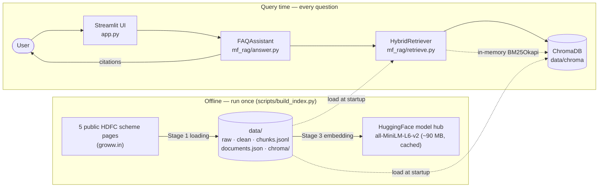
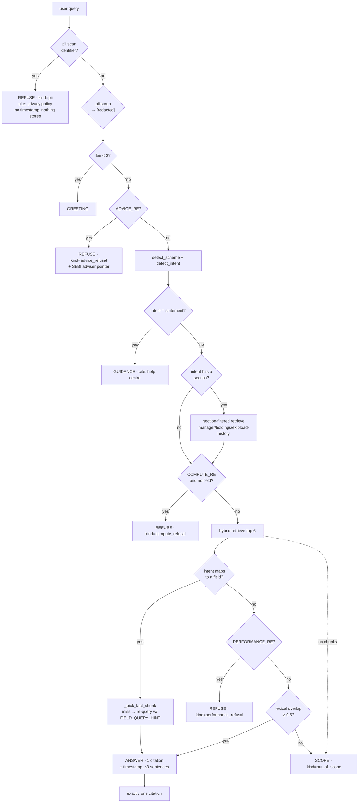

# Architecture — HDFC Mutual Fund Facts-Only RAG Assistant

**Companion to:** `PRD.md` (requirements) · `README.md` (setup + narrative)
**Scope of this document:** how the system is built, why each stage works the way it does, and
where the design deliberately refuses to be clever.

> **Reader's shortcut.** If you only want the demo path: `scripts/build_index.py` runs stages 1–4
> offline, `app.py` runs stage 5–6 per question. Section 4 is the whole system in one diagram.

---

## 1. Architectural drivers

Every structural choice below traces back to one of these five. When a design looks unusual, it is
usually answering one of them.

| # | Driver | Consequence |
|---|---|---|
| **D1** | *Answers must be grounded in a citation.* | Stage 6 has **no language model**. Sentences are copied from retrieved chunks, so grounding is structural — a wrong answer is a test failure, not a hallucination. |
| **D2** | *The corpus is a labelled fact sheet, not prose.* | Each `label: value` becomes its **own atomic chunk**. Fixed windows were built and measured, and lost badly (§4.2). |
| **D3** | *Queries are numeric lookups (`1.21%`, `NIFTY 500 TRI`, `3Y`).* | **Hybrid** retrieval. Dense alone is weak on exact tokens; BM25 alone is weak on paraphrase. RRF fuses the two orderings. |
| **D4** | *The embedded `__NEXT_DATA__` JSON is stale.* | The page is parsed **twice**; visible rendered text always wins, the payload is a conflict *detector* only. 14 conflicts recorded across 5 pages (§4.1). |
| **D5** | *Financial domain — advice and PII are hazards, not features.* | A 4-rung guardrail ladder runs **before retrieval**, and refusals are first-class answer kinds with their own citations. |

## 2. System context



**Trust boundary:** everything is local. After the index is built there is **no network call at
answer time** — no API key, no external model, no telemetry (`anonymized_telemetry=False`).

| Dependency | Version | Role |
|---|---|---|
| `chromadb` | ≥1.5.9 | Persistent vector store, cosine space |
| `sentence-transformers` | ≥6.1.0 | MiniLM embeddings, runs locally on CPU |
| `transformers` | ≥5.17.0 | Wordpiece tokenizer for exact chunk sizing |
| `rank-bm25` | ≥0.2.2 | Sparse retrieval |
| `beautifulsoup4` + `lxml` | ≥4.15 / ≥6.1.3 | HTML parsing |
| `requests` | ≥2.34.2 | Fetching with retry/backoff |
| `streamlit` | ≥1.64.0 | UI |

## 3. Layer map

```
┌──────────────────────────────────────────────────────────────────┐
│ PRESENTATION      app.py · deliverables/                        │
│                  welcome, 3 example questions, disclaimer,      │
│                  source link, timestamp, retrieval trace        │
├──────────────────────────────────────────────────────────────────┤
│ ORCHESTRATION     mf_rag/pipeline.py                            │
│                  get_assistant() [lru_cache] · EXAMPLE_QUESTIONS│
├──────────────────────────────────────────────────────────────────┤
│ ANSWER            mf_rag/answer.py        mf_rag/pii.py         │
│ (Stage 6)         intent routing, refusals,  identifier scan +   │
│                  extractive sentences,       scrub (pre-retrieval)│
│                  one citation, ≤3 sentences                      │
├──────────────────────────────────────────────────────────────────┤
│ RETRIEVAL         mf_rag/retrieve.py                             │
│ (Stage 5)         dense k=8 ⊕ BM25 k=8 → RRF(k=60) → k=4        │
│                  + scheme boost ×1.35, + section filter          │
├──────────────────────────────────────────────────────────────────┤
│ PERSISTENCE       mf_rag/embed_store.py                          │
│ (Stages 3–4)      MiniLM encode · ChromaDB upsert/query          │
├──────────────────────────────────────────────────────────────────┤
│ TRANSFORM         mf_rag/chunking.py                            │
│ (Stage 2)         atomic facts · recursive prose · tokenizer     │
│                  limits · fixed-window baseline for comparison   │
├──────────────────────────────────────────────────────────────────┤
│ SOURCES           mf_rag/sources.py       mf_rag/config.py       │
│                   5-source registry,       paths, model name,    │
│                   disclaimer, edu links    chunk/retrieval consts│
├──────────────────────────────────────────────────────────────────┤
│ INGESTION         mf_rag/ingest.py                               │
│ (Stage 1)         fetch · dual parse · conflict detect ·         │
│                  typed fact + prose extraction                  │
└──────────────────────────────────────────────────────────────────┘
```

**Dependency rule:** every layer imports only from layers below it. `answer.py` is the only module
that knows about both retrieval and PII; nothing below it knows that a UI exists.

## 4. The pipeline

### 4.0 End-to-end

```
 5 public pages
    │
    ├─▶ 1. LOADING      requests + BeautifulSoup/lxml
    │                  content window isolated; nav/footer dropped
    │                  visible text vs __NEXT_DATA__ conflict check
    │                          ↓
    │                  5 Documents: 111 typed Facts + 52 ProseBlocks
    │                          ↓
    ├─▶ 2. CHUNKING     22 facts/page → atomic chunks (never split)
    │                  prose → recursive split + pack
    │                  sized with the real MiniLM tokenizer
    │                          ↓
    │                  168 chunks (111 fact + 57 prose), mean 52 tok
    │                          ↓
    ├─▶ 3. EMBEDDING    all-MiniLM-L6-v2, 384-dim, L2-normalised
    │                          ↓
    ├─▶ 4. VECTOR DATA  ChromaDB "hdfc_mutual_funds", cosine, on disk
    │
    ══════════════ index built — query time ══════════════
    │
    ├─▶ 5. RETRIEVAL    dense top-8 + BM25 top-8 → RRF(k=60) → top-4
    │                  ×1.35 if scheme named; hard section filter
    │                          ↓
    └─▶ 6. GENERATION   intent route → re-query w/ field hint →
                       quote matched sentences verbatim, hard cap 3
                       + exactly one citation + timestamp
```

### 4.1 Stage 1 — Loading (`mf_rag/ingest.py`)

| | |
|---|---|
| **Input** | 5 URLs from `SOURCES` |
| **Process** | `fetch` → `block_leaf_lines` → `content_window` → 7 section parsers → `detect_conflicts` |
| **Output** | `Document` objects; `data/raw/*.html`, `data/clean/*.txt`, `data/ingest_log.json` |

Four decisions worth knowing:

1. **Schema-driven, not generic extraction** (`ingest.py:3-6`). The page has no semantic DOM
   landmarks and its label/value pairs are split across sibling elements. So each field is located
   by a *known label* and paired with the value on the following line (`_next_value`,
   `ingest.py:207`). A generic scraper would have produced interleaved noise.

2. **Leaf-block line extraction** (`block_leaf_lines`, `ingest.py:150`). Walk a block-tag
   allowlist, `script`/`style`/`svg`/`template`/`iframe` decomposed, and keep only blocks that
   contain **no** text-bearing child. Result: one flat, ordered line list — a document shape that
   makes every downstream parser a simple sequential scan.

3. **Content-window isolation** (`content_window`, `ingest.py:163`). Start at the line where the
   scheme name is followed by a top-level category (`Equity`/`Hybrid`/`Debt`) or a lock-in marker;
   stop at the first end marker (`Contact Us`, `Download the App`, `Show More`, `Others:`,
   `© 2016-`). This is what keeps the "content window excludes nav and footer" test green.

4. **Dual parse with visible-text precedence** (`detect_conflicts`, `ingest.py:428`). The
   `__NEXT_DATA__` payload is read but **never trusted**. Three checks — `nfo_risk`,
   `fund_manager`, `launch_date` — and every mismatch is logged. Measured result:

   | Page | Lines | Facts | Prose | Conflicts |
   |---|---:|---:|---:|---:|
   | Large Cap | 426 | 22 | 10 | 3 |
   | Flexi Cap | 565 | 22 | 9 | 3 |
   | ELSS | 456 | 23 | 9 | 3 |
   | Small Cap | 579 | 22 | 10 | 2 |
   | Balanced Advantage | 1657 | 22 | 14 | 3 |
   | **Total** | | **111** | **52** | **14** |

   Every page disagreed with its own payload on **riskometer** (`Very High Risk` vs
   `Moderately High`) and **launch date** (`10 Dec 1999` vs `01-Jan-2013`); four also named a
   fund manager (`Prashant Jain`, `Vinay Kulkarni`, `Srinivas Rao Ravuri`) who does not appear on
   the visible page. Had the payload been trusted, the assistant would have published a wrong
   riskometer on all five funds. This is D4 paying for itself.

**Extracted field types.** Facts land in labelled sections: `Key facts` (min SIP, AUM, expense
ratio, rating, min 1st/2nd, NAV, riskometer, lock-in, category, sub-category), `Fees, exit load
and tax` (exit load, stamp duty, tax implication), `Benchmark`, `Objective`, `Scheme details`
(fund house, rank, total AUM, incorporation date, launch date, custodian, RTA). Prose covers
about-the-scheme, manager bios, holdings, exit-load history and glossary.

### 4.2 Stage 2 — Chunking (`mf_rag/chunking.py`)

**Strategy: two chunk types, chosen from the shape of the data.**

| Type | Rule | Why |
|---|---|---|
| `fact` | One chunk per `Fact`. **Never split.** Text = `"{scheme} ({category}). {section}. {label}: {value}"` | D2 — the label must travel with its value, or retrieval returns a bare number |
| `prose` | `_split_recursive` on `SEPARATORS` (`\n\n`, `\n`, `. `, `; `, `, `, ` `, `""`), then `_pack` to target with overlap | Manager bios and holdings tables have no natural small unit |

- **Sizes are measured in real wordpiece tokens**, not words (`count_tokens_minilm`,
  `chunking.py:39`). Target **180**, overlap **40**, hard max **250**. Measured: 168 chunks,
  mean 52 tokens, **0 over the hard max**.
- **Embedding text ≠ citation text.** `Chunk.text` is label-prefixed (good for recall);
  `Chunk.cite_text` is the bare page wording (good for quoting). Mixing them would leak
  assistant-authored phrasing into a "verbatim" answer.
- **Deduplication** on lowercased `text` fingerprint; `ordinal` records position within a section
  so the manager answer can restore reading order.
- `fixed_size_chunks(…, 180, 40)` is retained **only** as the measured baseline for
  `scripts/compare_chunking.py`. It is not used in production.

**Why not one fixed size — the measurement that decided it.**
`scripts/benchmark_retrieval.py`, same model, same 35 labelled queries, same dense retriever:

| Strategy | Chunks | Top-1 hit | Top-3 hit |
|---|---:|---:|---:|
| **Structure-aware** (atomic facts + prose) | 168 | **74.29%** | **94.29%** |
| Fixed 180-token windows | 24 | 2.86% | 22.86% |

A 180-token window on a factsheet page holds ~6 unrelated fields, so the top hit for "expense
ratio of HDFC ELSS" is a window that merely *contains* the ratio among five other numbers. Two
honest caveats: the first metric tried (label+value co-occurrence) was **1.0 for both strategies**
and proved nothing — the retrieval benchmark is the real evidence; and the benchmark is
**dense-only**, so the shipped hybrid configuration is un-scored on its own.

### 4.3 Stage 3 — Embedding (`mf_rag/embed_store.py`)

- `sentence-transformers/all-MiniLM-L6-v2`, **384-dim**, `normalize_embeddings=True`,
  `batch_size=32`. Embeds `Chunk.text` (label-prefixed), not `cite_text`.
- Model and tokenizer are **module-level singletons** (`_MODEL`, `embed_store.py:27`) so a
  Streamlit session loads them once, not per query.
- `count_tokens_minilm` degrades to a word count if `transformers` is unavailable — sizing
  degrades, the pipeline still runs.

### 4.4 Stage 4 — Vector store

- ChromaDB `PersistentClient` at `data/chroma`, `Settings(anonymized_telemetry=False)`.
- Collection `hdfc_mutual_funds`, metadata `{"hnsw:space": "cosine", "embed_model": …}`.
  Cosine is the right space because vectors are L2-normalised — distance is then monotone in dot
  product.
- Stored per chunk: `id = chunk_id`, `document = text`, `embedding`, and metadata carrying
  `scheme_name`, `scheme_short`, `category`, `plan`, `section`, `heading`, `kind`, `field`,
  `as_of`, `source_url`, `retrieved_at`, `ordinal`, `cite_text`, `chunk_id`. **The metadata is
  the citation mechanism** — `source_url` and `retrieved_at` travel with every vector, so an
  answer can always name its page and stamp.
- Writes are **idempotent upserts**: chunk ids are `sha1(key||parts)[:16]`, so a rebuild replaces
  rather than duplicates.
- `data/chunks.jsonl` is written alongside the store because BM25 needs the chunk objects in
  memory anyway, and the answer stage needs `cite_text` + `ordinal`. Chroma alone is not a
  sufficient system of record.

### 4.5 Stage 5 — Retrieval (`mf_rag/retrieve.py`)

```
query
  │
  ├─ allowed = {chunk_id : chunk.section == section}   ← only when an intent hard-filters
  ├─ dense  = Chroma top-8            (where chunk_id ∈ allowed)
  ├─ sparse = BM25Okapi top-8         (filtered to allowed, score > 0)
  │
  ├─ RRF:  for each list, score[chunk] += 1 / (60 + rank)        k = 60
  ├─ × 1.35  if chunk.scheme_short == scheme named in the query
  ├─ × 1.05  if chunk.field ∈ BOOST_FIELDS and a scheme was named
  │
  └─ sort desc → top-4
```

**RRF, concretely.** For chunk *c*:

```
rrf(c) = Σ  1 / (60 + rank_i(c))     over lists i ∈ {dense, bm25}
       × 1.35  if c matches the named scheme
       × 1.05  if c's field ∈ BOOST_FIELDS and a scheme was named
```

Sum-of-reciprocal-ranks is used precisely because it needs **no score calibration**. A cosine
distance and a BM25 score are not comparable quantities; their *ranks* are. `RRF_K = 60` is the
standard value and damps rank-1 dominance so a single list cannot win alone.

**Why hybrid (D3).** Dense retrieval on MiniLM is weak on `1.21%`, `NIFTY 50 Hybrid Composite
Debt 50:50`, `80C`, `3Y`; BM25 is weak on "what does it cost me to hold this". Either alone drops
one class of query.

**Scheme resolution** is a two-pass substring match (`retrieve.py:87` and, for the answer stage,
`answer.py:255`): full names first (`display_name`, `scheme_name`, `scheme_short`), then aliases
(`elss`, `80c`, `tax saver`, `bluechip`, `flexicap`, …). The Flexi Cap page is *titled*
`HDFC Flexi Cap Direct Plan Growth` but the registered name is `HDFC Equity Fund Direct Growth`;
both resolve, and answers use the registered name.

**BM25 corpus** is `f"{heading} {cite_text} {text}"` — heading first so a field label is the most
salient token in its own document.

### 4.6 Stage 6 — Generation (`mf_rag/answer.py`)

There is no model. The sequence is a **guardrail ladder, then routing, then quotation**:



Design points that matter for review:

- **Guardrails run before retrieval** (`ask`, `answer.py:379-409`). A PII message never reaches
  the vector store, and a refusal costs no embedding work.
- **The timestamp is conditional.** PII refusal is the *only* answer kind with no
  `Last updated from sources:` stamp — because no source page was consulted. Every other path
  carries the stamp of the page it actually cited.
- **Intent routing with a retry.** If the field chunk isn't in the top-6, the assistant re-queries
  with a field-specific lexical hint (`FIELD_QUERY_HINT`, e.g. `"Min. for SIP minimum SIP
  amount"`), because dense similarity on a short label like `Rating` is unreliable.
- **Specific beats generic.** Intent patterns are ordered; `exit_load_history` is tested before
  `exit_load`, and `category` after `sub_category`.
- **Answer scoping.** If the user named a scheme, results are re-filtered to that scheme
  (`answer.py:534`) — this is what stops cross-scheme contamination.
- **`_fact_sentence`** prefixes `"On the {scheme} page:"` when no scheme was named, so an unscoped
  answer never implies it applies to all five funds.
- **Manager answers are assembled, not concatenated.** `_manager_answer` sorts the section by
  `ordinal`, parses `name (tenure)`, names the primary, and adds "The page also lists …" for the
  rest — still 100% page wording, still ≤3 sentences.

## 5. Data model

| Type | Module | Key fields | Lives for |
|---|---|---|---|
| `Source` | `sources.py` | `key`, `scheme_name`, `scheme_short`, `category`, `plan`, `url`, `page_name`, `tags` | process (frozen dataclass) |
| `Fact` | `ingest.py` | `field_name`, `label`, `value`, `section`, `as_of` | build |
| `ProseBlock` | `ingest.py` | `heading`, `text`, `section` | build |
| `Document` | `ingest.py` | `source`, `lines`, `facts`, `prose`, `payload`, `links`, `retrieved_at`, `conflicts` | build |
| `Chunk` | `chunking.py` | `chunk_id`, `text`, `cite_text`, `kind`, `section`, `field_name`, `source_url`, `retrieved_at`, `token_count`, `ordinal` | persisted → `chunks.jsonl` + Chroma |
| `RetrievedChunk` | `retrieve.py` | `chunk_id`, `cite_text`, `scheme_short`, `field_name`, `source_url`, `rrf_score`, `vector_rank`, `bm25_rank`, `reasons` | per query |
| `Answer` | `answer.py` | `text`, `citations`, `retrieved_at`, `intent`, `kind`, `chunks`, `refused`, `pii_kinds`, `notes` | per query |
| `VectorHit` | `embed_store.py` | `chunk_id`, `score` (= `1 - cosine_distance`), `metadata` | per dense query |

**`Answer.kind` is the contract the UI renders on** (`app.py:66-71`):
`fact` · `guidance` · `greeting` · `empty` · `out_of_scope` · `advice_refusal` ·
`performance_refusal` · `compute_refusal` · `pii`.

## 6. Storage layout

```
data/
  raw/<key>.html              fetched HTML (enables --refresh-free rebuilds)
  clean/<key>.txt             human-readable FACTS / PROSE dump
  chunks.jsonl                168 chunks — the system of record
  documents.json              structured documents (facts, prose, links, conflicts)
  chroma/                     persistent ChromaDB
  chroma_bench/               isolated store for the chunking benchmark
  ingest_log.json             per-page fetch origin, counts, conflicts
  chunking_report.json        diagnostic only (co-occurrence metric — see caveat)
  retrieval_benchmark.json    35-query dense-only retrieval results
```

**Idempotency contract:** `--refresh` re-fetches; without it, `load_documents` reuses
`data/raw/*.html` (`ingest.py:486`). So embeddings can be rebuilt and benchmarks re-run with **no
network**, which is what makes the retrieval evaluation reproducible.

## 7. Configuration surface

All tunables live in `mf_rag/config.py` — no magic numbers in the pipeline.

| Constant | Value | Effect |
|---|---:|---|
| `EMBEDDING_MODEL` | `sentence-transformers/all-MiniLM-L6-v2` | Stage 3 model |
| `EMBEDDING_DIM` | 384 | Expected vector width |
| `MAX_EMBEDDING_TOKENS` | 256 | Model input ceiling |
| `CHUNK_TOKEN_TARGET` | 180 | Stage 2 packing target |
| `CHUNK_TOKEN_OVERLAP` | 40 | Stage 2 prose overlap |
| `CHUNK_TOKEN_HARD_MAX` | 250 | Stage 2 ceiling (0 violations) |
| `CHROMA_COLLECTION` | `hdfc_mutual_funds` | Store namespace |
| `RETRIEVE_VECTOR_K` | 8 | Dense candidate depth |
| `RETRIEVE_BM25_K` | 8 | Sparse candidate depth |
| `RETRIEVE_FINAL_K` | 4 | Chunks kept after fusion |
| `RRF_K` | 60 | Fusion damping constant |
| `MAX_ANSWER_SENTENCES` | 3 | Answer cap |
| `MAX_CONTEXT_CHUNKS` | 6 | **Declared but unused** — see §11 |
| `MIN_HYBRID_SCORE` | 0.0 | **Declared but unused** — see §11 |
| `BOOST_FIELDS` (`retrieve.py:28`) | 7 fields ×1.05 | expense_ratio, exit_load, min_sip, min_lumpsum, benchmark, riskometer, lock_in |
| Scheme boost (`retrieve.py:160`) | ×1.35 | Applied when a scheme is named |
| `MIN_LEXICAL_OVERLAP` (`answer.py:201`) | 0.5 | Scope-gate threshold |
| `MAX_HOLDINGS` (`ingest.py:38`) | 25 | Holdings rows captured per page |

## 8. Key design decisions

| # | Decision | Alternative rejected | Why |
|---|---|---|---|
| **AD-1** | No LLM in stage 6 | Few-shot prompt + citations | D1. Citations *claim* grounding; extraction *guarantees* it. Also removes API cost, key management and network dependency. Cost: answers read like a fact sheet. |
| **AD-2** | Atomic fact chunks | Fixed 180-token windows | 74.29% vs 2.86% top-1 (§4.2). |
| **AD-3** | Hybrid dense + BM25 with RRF | Dense only | D3. RRF avoids score calibration between incomparable score types. |
| **AD-4** | Visible text beats `__NEXT_DATA__` | Trust the embedded JSON | 14 logged conflicts; trusting the payload would publish a wrong riskometer on all 5 funds. |
| **AD-5** | Guardrails before retrieval | Guardrails after generation | A PII message must never reach the store; refusals should not cost an embedding call. |
| **AD-6** | `chunks.jsonl` as system of record | Chroma-only | BM25 needs the chunks in RAM regardless, and stage 6 needs `cite_text` + `ordinal`. |
| **AD-7** | Chroma cosine + normalised vectors | Default L2 | With unit vectors, distance ordering equals dot-product ordering. |
| **AD-8** | Intent regexes over a small LLM router | Embedding-based intent classifier | Hand-written patterns are inspectable, testable, and auditable in a demo. Cost: English-phrasing brittleness. |
| **AD-9** | Chroma telemetry disabled | Default | Privacy constraint: no data leaves the machine, including from the vector DB. |

## 9. Failure modes

| Failure | Behaviour | Where |
|---|---|---|
| Page fetch fails | 3 attempts, linear backoff (1.5s, 3s, 4.5s), then `RuntimeError` | `ingest.py:122` |
| Page structure changes | Typed facts go missing → `test_every_source_has_all_core_fields` fails loudly rather than answering wrongly | `tests/test_faq.py` |
| Payload disagrees with page | Visible text used, conflict logged to `ingest_log.json` | `ingest.py:428` |
| Index not built | `PipelineMissing("Run: python scripts/build_index.py")`; UI shows the command | `pipeline.py:25`, `app.py:98` |
| No chunks retrieved | `out_of_scope` answer, never a guess | `answer.py:525` |
| Retrieval returns prose for a field question | `_fact_sentence` quotes the prose; if no field chunk at all → `out_of_scope` | `answer.py:538` |
| User query is a greeting | `GREETING`, no retrieval | `answer.py:398` |
| Query is PII | Refused pre-retrieval, nothing stored, privacy link cited | `answer.py:383` |
| Model/tokenizer unavailable | Tokenizer falls back to word count; sizing degrades, pipeline continues | `chunking.py:49` |
| Chroma empty | `query_vector` returns `[]` → `out_of_scope` rather than a crash | `embed_store.py:114` |

## 10. Security & privacy posture

| Control | Implementation |
|---|---|
| PII detection | 9 regex rules: PAN, Aadhaar, email, phone, OTP, card, account/folio, IFSC, passport (`pii.py:29`) |
| PII scrubbing | Every match replaced with `[redacted]` before any downstream processing |
| Storage | Nothing from a PII message is persisted; no DB, no log, no file |
| Refusal citation | Privacy policy URL — the one answer with a citation but no timestamp |
| Chroma telemetry | `anonymized_telemetry=False` |
| Network at answer time | None |
| Secrets | None. No API key exists in this system. |
| Source trust | 5 fixed URLs in `sources.py`; the corpus is closed, so a prompt-injection payload cannot enter the index |

**Residual risk:** PII detection is regex-based. An identifier in an unusual format (spaced PAN,
misspelled label) can pass the guard — mitigated by the fact that the assistant only ever emits
verbatim page text, so even a leak would be an *input* the user already typed, never stored or
amplified.

## 11. Known architectural debt

Recorded honestly rather than hidden:

1. **Two dead config constants.** `MIN_HYBRID_SCORE` and `MAX_CONTEXT_CHUNKS`
   (`config.py:34,37`) are never read. `FAQAssistant.__init__` takes `top_k: int = 6` as a literal
   default instead of `MAX_CONTEXT_CHUNKS`. Fix is one line each: import the constant, or delete
   it. Flagged because "the config file is the single source of tunables" is an architectural
   claim this doc makes, and right now it has two exceptions.
2. **Hybrid config is un-scored.** The 74.29% / 94.29% figures are dense-only. The shipped
   hybrid path — which is what actually runs — has no benchmark of its own.
3. **Retrieval is in-memory BM25 rebuilt per process.** Fine at 168 chunks; a larger corpus
   wants a persisted sparse index.
4. **Section filtering is a hard filter.** If a fact lives in an unexpected section, it becomes
   invisible to that query rather than merely outranked.
5. **Rule ordering is load-bearing.** `INTENTS` is first-match-wins; inserting a broad pattern
   above a specific one silently changes routing. Only tests catch this.
6. **Single-process singletons.** `_MODEL` and `_retriever` are module globals. Correct for
   Streamlit's one-process model, wrong for multi-worker serving.

## 12. Test architecture

29 tests, `python -m unittest discover -s tests -t .` — each group protects one architectural claim.

| Group | Tests | Protects |
|---|---:|---|
| `TestIngest` | 5 | Stage 1: all 5 sources load, core fields present, ELSS lock-in/nil exit load, boilerplate excluded, **visible page beats payload** |
| `TestPiiGuard` | 2 | Detection fires on identifiers, does not fire on ordinary questions |
| `TestRouting` | 5 | Alias resolution, specific-over-generic intent, correct field not a neighbour, AUM ≠ AMC total, advice patterns |
| `TestAnswers` | 17 | Stage 6: one citation per path, ≤3 sentences, **character-for-character grounding**, no cross-scheme contamination, manager/holdings/statement handling, all four refusals, out-of-scope, no identifier leakage, conditional timestamp, greeting |

`scripts/test_ui.py` is a Streamlit `AppTest` smoke test for the presentation layer.

**The load-bearing test** is `test_answers_are_grounded_in_retrieved_chunks`: it asserts every
fact answer appears verbatim in the corpus. That single assertion is what turns D1 from a design
claim into an enforced invariant — a hallucination cannot pass CI.

## 13. Extension points

| To add… | Do this | No other change needed |
|---|---|---|
| A scheme | Append a `Source` to `SOURCES` (`sources.py:39`) | Ingestion, chunking, retrieval, citation all key off the registry |
| A field | Add a `LABEL_FIELDS` / `contact_fields` entry + a parser rule in `ingest.py`; add an `INTENTS` entry + `FIELD_QUERY_HINT` in `answer.py` | Chunking picks up the new `Fact` automatically |
| An intent | Append to `INTENTS`; optionally add to `FIELD_QUERY_HINT` or `SECTION_FOR_INTENT` | Routing + retry work as-is |
| A section | Emit a `ProseBlock` with that `section`; map the intent in `SECTION_FOR_INTENT` | Section filter picks it up |
| A refusal class | Add a regex + template, return an `Answer` with `refused=True` and its own citation | UI renders by `kind` |
| A different AMC | Point `SOURCES` at new URLs; the Flexi Cap naming quirk is handled by the `display_name`/`scheme_name` pair | Everything else is AMC-agnostic |
| A real LLM (later) | Insert between stages 5 and 6, constrained to quote retrieved spans | Keep `test_answers_are_grounded_in_retrieved_chunks` as the gate |

## 14. Demo path

```powershell
python -m venv .venv
.\.venv\Scripts\python.exe -m pip install -r requirements.txt
.\.venv\Scripts\python.exe scripts\build_index.py     # stages 1–4, prints IndexStats
.\.venv\Scripts\python.exe -m streamlit run app.py    # stages 5–6
```

Three questions to have ready, in order — they walk the architecture:

| # | Ask | Shows |
|---|---|---|
| 1 | *"What is the expense ratio of HDFC Flexi Cap Fund?"* | Intent → field chunk → verbatim answer + one citation. Toggle **Show retrieval trace** to display dense rank, BM25 rank, RRF score and the ×1.35 scheme boost. |
| 2 | *"Should I buy HDFC Small Cap Fund?"* | `ADVICE_RE` firing **before** retrieval; refusal with an SEBI adviser pointer. |
| 3 | *"My PAN is ABCDE1234F, check my returns"* | PII refusal with the privacy citation and **no timestamp** — the one path that consults no page. |

Then, if asked *"how do you know it isn't hallucinating?"*: the answer is that there is no
generator. Point at `test_answers_are_grounded_in_retrieved_chunks` and at the retrieval trace.

---

### Appendix — glossary

| Term | Meaning here |
|---|---|
| **Chunk** | The unit that is embedded, stored and retrieved. 168 of them. |
| **`cite_text`** | Page wording, quoted verbatim in answers. Distinct from `text`, which is label-prefixed for retrieval. |
| **Fact / ProseBlock** | Stage 1 outputs: a typed `label: value` pair, or an unstructured block with a heading. |
| **RRF** | Reciprocal Rank Fusion — `Σ 1/(k + rank)` across ranked lists; needs no score calibration. |
| **Guardrail ladder** | The fixed refusal order: PII → advice → performance → projection, plus a post-retrieval scope gate. |
| **Grounding** | Every emitted sentence exists character-for-character in the corpus, and is enforced by a test. |
| **Content window** | The slice of a page between the scheme heading and the first end marker; excludes nav and footer. |
